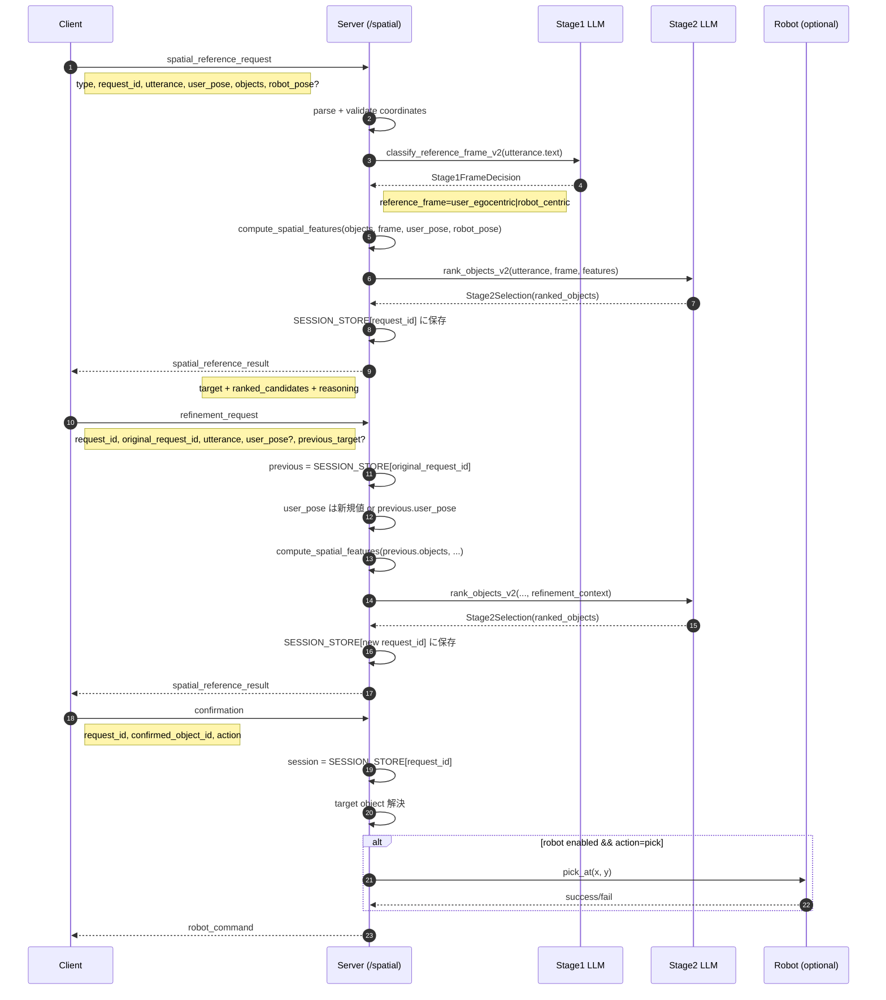

# Spatial Flow / LLM I-O 可視化

## 1) 3ステップ対話フロー（WebSocket `/spatial`）



---

## 2) LLMの入力/出力型（3ステップ本体）

```mermaid
flowchart TD
		A[Client Message<br/>SpatialReferenceRequest] --> B[Server Parse/Validate]
		B --> C[Stage1 Input<br/>utterance: string]
		C --> D[Stage1 LLM<br/>model=openai:OPENAI_MODEL_LIGHT<br/>default gpt-4o-mini]
		D --> E[Stage1 Output<br/>Stage1FrameDecision]

		E --> F[Feature Builder<br/>compute_spatial_features]
		A --> F

		F --> G[Stage2 Input Payload<br/>{utterance, reference_frame, objects[], refinement_context?}]
		G --> H[Stage2 LLM<br/>model=openai:OPENAI_MODEL<br/>default gpt-5.2]
		H --> I[Stage2 Output<br/>Stage2Selection]

		I --> J[Server Response Builder<br/>spatial_reference_result]
		J --> K[Client]
```

---

## 3) 型サマリ（簡略）

```mermaid
classDiagram
		class SpatialReferenceRequest {
			+type: "spatial_reference_request"
			+request_id: str
			+timestamp: str?
			+utterance: UtteranceModel
			+user_pose: UserPoseModel
			+objects: ObjectModel[]
			+robot_pose: RobotPoseModel?
		}

		class RefinementRequest {
			+type: "refinement_request"
			+request_id: str
			+original_request_id: str
			+utterance: UtteranceModel
			+user_pose: UserPoseModel?
			+previous_target: str?
		}

		class ConfirmationRequest {
			+type: "confirmation"
			+request_id: str
			+confirmed_object_id: str
			+action: str = "pick"
		}

		class Stage1FrameDecision {
			+reference_frame: user_egocentric | robot_centric
			+confidence: float
			+spatial_keywords: string[]
		}

		class Stage2Selection {
			+ranked_objects: RankedObject[]
		}

		class RankedObject {
			+object_id: str
			+score: float
			+reason: str
		}

		class SpatialReferenceResult {
			+type: "spatial_reference_result"
			+request_id: str
			+target.object_id: str|null
			+target.confidence: float
			+target.reference_frame: user_egocentric | robot_centric
			+ranked_candidates: {object_id, score}[]
			+reasoning: str
		}

		SpatialReferenceRequest --> Stage1FrameDecision
		Stage1FrameDecision --> Stage2Selection
		Stage2Selection --> SpatialReferenceResult
		RefinementRequest --> Stage2Selection
		ConfirmationRequest --> SpatialReferenceResult
```

